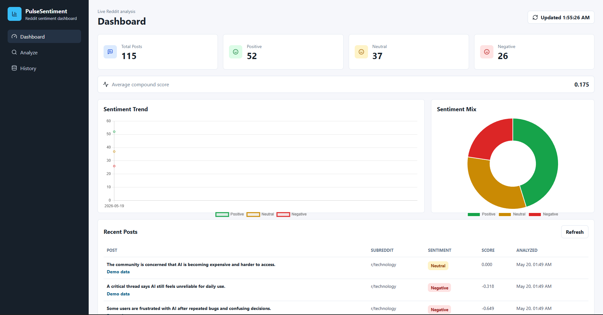
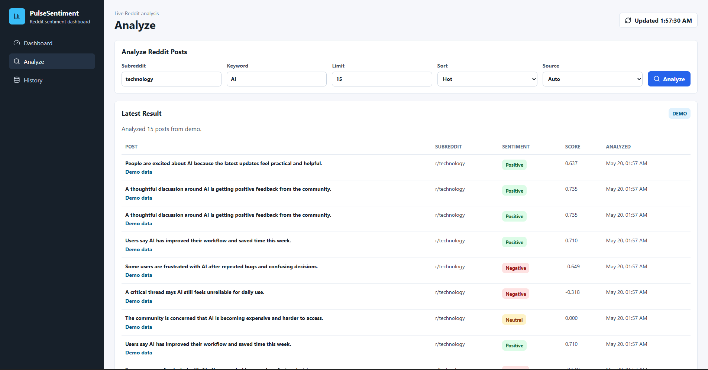
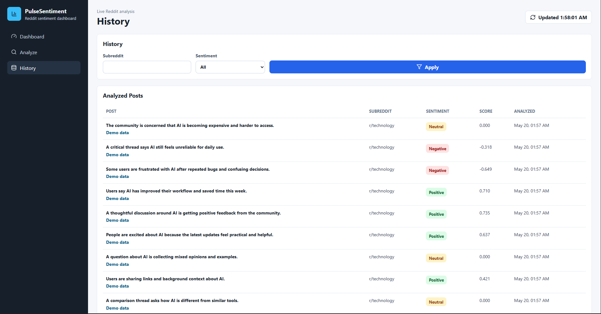
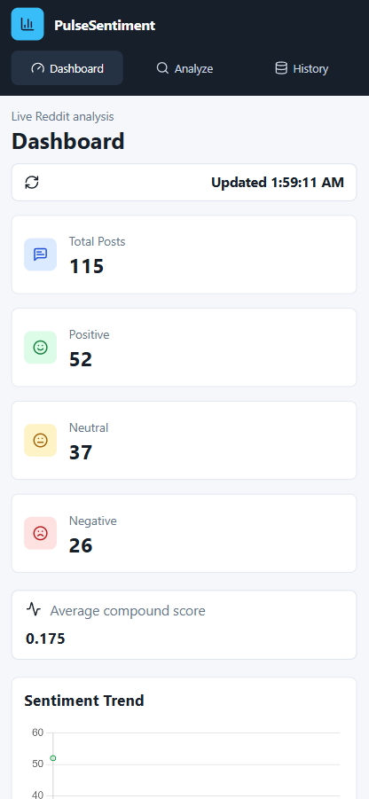
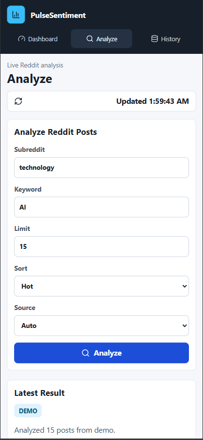
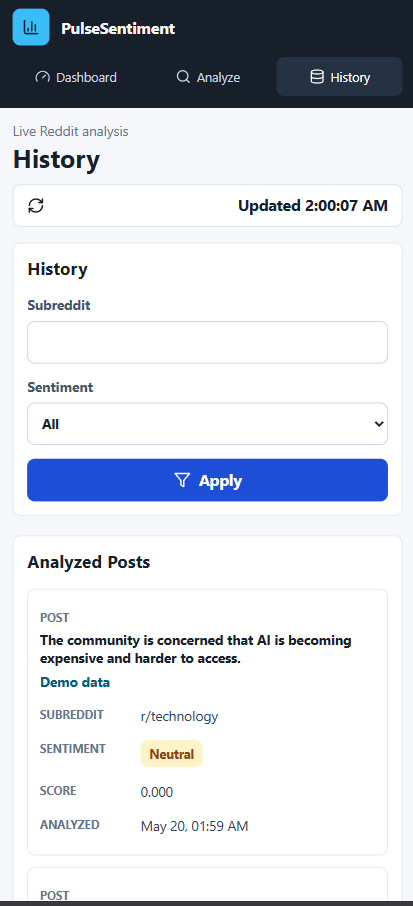

# PulseSentiment 📊

> **Analyze Reddit sentiment in real-time.** PulseSentiment is a full-stack application that fetches Reddit posts, runs VADER sentiment analysis, and visualizes trends in an interactive dashboard. Works with real Reddit data or demo mode—no credentials required to get started.


---

## 🎯 Quick Start (2 minutes)

Get PulseSentiment running locally **without Reddit credentials** using demo data:

### **Prerequisites**
- Python 3.9+ and Node.js 16+
- Git

### **Windows (PowerShell)**
```powershell
# Clone and navigate
git clone https://github.com/yourusername/PulseSentiment.git
cd PulseSentiment

# Backend setup
cd backend
python -m venv .venv
.\.venv\Scripts\Activate.ps1
pip install -r requirements.txt
$env:FORCE_DEMO_SOURCE="true"
uvicorn app.main:app --reload --host 127.0.0.1 --port 8000

# In a new terminal: Frontend setup
cd frontend
npm install
npm run dev

# Open browser
start http://127.0.0.1:5173
```

### **Mac/Linux (Bash)**
```bash
# Clone and navigate
git clone https://github.com/yourusername/PulseSentiment.git
cd PulseSentiment

# Backend setup
cd backend
python3 -m venv .venv
source .venv/bin/activate
pip install -r requirements.txt
export FORCE_DEMO_SOURCE=true
uvicorn app.main:app --reload --host 127.0.0.1 --port 8000

# In a new terminal: Frontend setup
cd frontend
npm install
npm run dev

# Open browser
open http://127.0.0.1:5173
```

**Done!** The dashboard loads with 50 demo posts ready to analyze.

---

## 📸 Dashboard Preview

<div align="center">

### Main Dashboard - Real-Time Sentiment Analytics


*View sentiment statistics, trend charts, sentiment distribution pie chart, and recent analyzed posts*

---

### Analyze Page - Fetch & Process Reddit Posts


*Select subreddit, keyword, limit, sort mode, and data source. Analyze posts and view results instantly*

---

### History Page - Browse All Analyzed Posts


*Browse complete history of analyzed posts with filtering by subreddit and sentiment classification*

---

### Mobile Responsive Design

**Dashboard on Mobile**


**Analyze Form on Mobile**


**History on Mobile**


</div>

---

## ✨ Features

- 🔍 **Fetch & Analyze**: Extract posts by subreddit, keyword, sort mode, and limit
- 📊 **VADER Sentiment Scoring**: Classify posts as positive, neutral, or negative with confidence scores
- 💾 **Persistent Storage**: Save analyzed posts in SQLite for historical trend analysis
- 📈 **Real-Time Dashboard**: 
  - Sentiment trend charts (line graph over time)
  - Sentiment distribution (pie chart)
  - Key statistics (total posts, average sentiment, trending mood)
  - Recent posts feed with sortable columns
- 🚀 **Demo Mode**: Analyze without Reddit credentials—perfect for testing
- 🔄 **Auto-Refresh**: Dashboard updates automatically every 30 seconds
- 📱 **Responsive UI**: Works on desktop and mobile browsers
- ⚡ **Fast Performance**: Built with FastAPI and optimized SQLite queries

---

## 🏗️ Architecture

```
┌─────────────────────────────────────────────────────────────┐
│                    Web Browser (React)                       │
│  ┌──────────────────────────────────────────────────────┐  │
│  │  Dashboard        │  Analyze Page    │  History Page  │  │
│  │  • Sentiment      │  • Form Inputs   │  • Stored      │  │
│  │    Trends        │  • Real-time     │    Posts       │  │
│  │  • Statistics    │    Progress      │  • Filtering   │  │
│  │  • Recent Posts  │                  │  • Sorting     │  │
│  └──────────────────────────────────────────────────────┘  │
└─────────────────────┬──────────────────────────────────────┘
                      │ HTTP/JSON
        ┌─────────────▼──────────────┐
        │   FastAPI Backend          │
        │  ┌────────────────────┐    │
        │  │ API Routes         │    │
        │  │ • /health          │    │
        │  │ • /api/analyze     │    │
        │  │ • /api/dashboard   │    │
        │  │ • /api/posts       │    │
        │  └────────────────────┘    │
        │  ┌────────────────────┐    │
        │  │ Services           │    │
        │  │ • Sentiment        │    │
        │  │ • Reddit API       │    │
        │  │ • Database         │    │
        │  └────────────────────┘    │
        └─────────────┬──────────────┘
                      │
        ┌─────────────▼──────────────┐
        │  Data Layer (SQLite)       │
        │  ┌────────────────────┐    │
        │  │ posts table        │    │
        │  │ • reddit_id        │    │
        │  │ • title/body       │    │
        │  │ • sentiment_label  │    │
        │  │ • sentiment_score  │    │
        │  │ • analyzed_at      │    │
        │  └────────────────────┘    │
        └────────────────────────────┘
```

---

## 🛠️ Tech Stack

| Layer | Technology | Purpose |
|-------|-----------|---------|
| **Frontend** | React 18, Vite, TypeScript | Interactive dashboard and UI |
| **Styling** | Tailwind CSS, Chart.js | Design system and data visualization |
| **Icons** | lucide-react | Consistent icon library |
| **Backend** | FastAPI, Pydantic | High-performance REST API |
| **NLP** | VADER (nltk) | Sentiment analysis |
| **Data Source** | PRAW (Reddit API) | Real Reddit post ingestion |
| **Database** | SQLite 3 | Local persistent storage |
| **Testing** | pytest, FastAPI TestClient | Backend coverage |

---

## 📋 Project Structure

```
PulseSentiment/
├── backend/
│   ├── app/
│   │   ├── api/
│   │   │   └── routes.py              # REST endpoints
│   │   ├── core/
│   │   │   ├── config.py              # Settings & environment
│   │   │   └── constants.py           # Shared constants
│   │   ├── db/
│   │   │   ├── database.py            # SQLite connection
│   │   │   └── repository.py          # Data access layer
│   │   ├── models/
│   │   │   └── post.py                # SQLAlchemy models
│   │   ├── schemas/
│   │   │   └── post.py                # Pydantic validation
│   │   ├── services/
│   │   │   ├── sentiment.py           # VADER analyzer
│   │   │   ├── reddit.py              # Reddit & demo data
│   │   │   └── dashboard.py           # Analytics queries
│   │   └── main.py                    # App entry point
│   ├── tests/
│   │   ├── test_api.py                # Endpoint tests
│   │   ├── test_sentiment.py          # VADER tests
│   │   └── test_db.py                 # Database tests
│   ├── .env.example                   # Environment template
│   ├── requirements.txt               # Python dependencies
│   └── pytest.ini                     # Test configuration
│
├── frontend/
│   ├── src/
│   │   ├── api/
│   │   │   └── client.ts              # API wrapper
│   │   ├── components/
│   │   │   ├── Dashboard.tsx          # Main dashboard
│   │   │   ├── AnalyzePage.tsx        # Post submission form
│   │   │   ├── HistoryPage.tsx        # Stored posts
│   │   │   ├── TrendChart.tsx         # Sentiment over time
│   │   │   ├── SentimentMix.tsx       # Pie chart
│   │   │   └── PostTable.tsx          # Posts grid
│   │   ├── pages/
│   │   │   └── Layout.tsx             # Router & navigation
│   │   ├── types/
│   │   │   └── index.ts               # TypeScript interfaces
│   │   ├── App.tsx                    # Root component
│   │   ├── main.tsx                   # React entry point
│   │   └── styles.css                 # Global styles
│   ├── public/
│   │   └── favicon.svg
│   ├── index.html                     # HTML template
│   ├── package.json                   # Node dependencies
│   └── vite.config.ts                 # Vite configuration
│
├── docs/
│   └── screenshots/                   # Dashboard screenshots
├── .gitignore
├── LICENSE                            # MIT License
└── README.md                          # This file
```

---

## 📦 Installation

### **Backend Setup**

**Windows (PowerShell):**
```powershell
Set-Location D:\03_PROJECTS\PulseSentiment\backend
python -m venv .venv
.\.venv\Scripts\Activate.ps1
pip install -r requirements.txt
Copy-Item .env.example .env
# Edit .env with your Reddit credentials (optional)
uvicorn app.main:app --reload --host 127.0.0.1 --port 8000
```

**Mac/Linux (Bash):**
```bash
cd ~/Projects/PulseSentiment/backend
python3 -m venv .venv
source .venv/bin/activate
pip install -r requirements.txt
cp .env.example .env
# Edit .env with your Reddit credentials (optional)
uvicorn app.main:app --reload --host 127.0.0.1 --port 8000
```

**Health Check:**
```bash
# In a new terminal
curl http://127.0.0.1:8000/health
# Response: {"status":"ok"}
```

### **Frontend Setup**

**Windows (PowerShell):**
```powershell
Set-Location D:\03_PROJECTS\PulseSentiment\frontend
npm install
npm run dev
# Open http://127.0.0.1:5173
```

**Mac/Linux (Bash):**
```bash
cd ~/Projects/PulseSentiment/frontend
npm install
npm run dev
# Open http://127.0.0.1:5173
```

**If npm is broken**, reinstall Node.js LTS or use Corepack:
```bash
corepack enable
corepack prepare pnpm@latest --activate
pnpm install
pnpm dev
```

---

## 🔑 Reddit Credentials (Optional)

PulseSentiment works in **demo mode without any setup**. For real Reddit data:

1. **Create a Reddit App:**
   - Go to https://www.reddit.com/prefs/apps
   - Click "Create App" or "Create Another App"
   - Fill in the form (select "script")
   - Note your `client_id` and `client_secret`

2. **Configure Environment:**
   ```bash
   # backend/.env
   REDDIT_CLIENT_ID=your_client_id_here
   REDDIT_CLIENT_SECRET=your_client_secret_here
   REDDIT_USER_AGENT=PulseSentimentMiniProject/1.0 by your_reddit_username
   FORCE_DEMO_SOURCE=false
   ```

3. **Force Demo Mode (to test without credentials):**
   ```bash
   # backend/.env
   FORCE_DEMO_SOURCE=true
   ```

---

## 🚀 API Reference

### **Health Check**
```http
GET /health
```
**Response:**
```json
{
  "status": "ok",
  "version": "1.0.0"
}
```

### **Analyze Posts**
```http
POST /api/analyze
Content-Type: application/json

{
  "subreddit": "technology",
  "keyword": "AI",
  "limit": 10,
  "sort": "hot",
  "source": "demo"
}
```

**Parameters:**
- `subreddit` (string, required): Subreddit name (e.g., "technology", "python")
- `keyword` (string, optional): Filter posts containing this keyword
- `limit` (integer, 1-100): Number of posts to fetch (default: 10)
- `sort` (string): "hot", "new", "top", "rising" (default: "hot")
- `source` (string): "demo", "reddit", or "auto" (default: "auto")

**Response:**
```json
{
  "total_analyzed": 10,
  "positive": 3,
  "neutral": 5,
  "negative": 2,
  "average_sentiment": 0.24
}
```

### **Get Dashboard Data**
```http
GET /api/dashboard
```

**Response:**
```json
{
  "stats": {
    "total_posts": 147,
    "positive_count": 45,
    "neutral_count": 68,
    "negative_count": 34,
    "average_sentiment": 0.18
  },
  "trends": [
    { "timestamp": "2024-01-15T10:00:00", "sentiment": 0.25 },
    { "timestamp": "2024-01-15T11:00:00", "sentiment": 0.32 }
  ],
  "recent_posts": [
    {
      "id": 1,
      "title": "Python 3.13 Released",
      "sentiment_label": "positive",
      "sentiment_score": 0.76,
      "analyzed_at": "2024-01-15T10:30:00"
    }
  ]
}
```

### **Get Stored Posts**
```http
GET /api/posts?sentiment=positive&limit=20&offset=0
```

**Query Parameters:**
- `sentiment` (string, optional): "positive", "neutral", "negative"
- `subreddit` (string, optional): Filter by subreddit
- `limit` (integer): Results per page (default: 20, max: 100)
- `offset` (integer): Pagination offset (default: 0)

---

## 💾 Database Schema

### **posts table**

| Column | Type | Description |
|--------|------|-------------|
| `id` | INTEGER PRIMARY KEY | Local database ID |
| `reddit_id` | TEXT UNIQUE NOT NULL | Reddit post ID or demo ID |
| `title` | TEXT NOT NULL | Post title |
| `body` | TEXT | Post body/selftext |
| `subreddit` | TEXT NOT NULL | Source subreddit |
| `author` | TEXT | Post author |
| `url` | TEXT | Reddit post URL |
| `created_utc` | INTEGER | Unix timestamp of post creation |
| `sentiment_label` | TEXT NOT NULL | "positive", "neutral", or "negative" |
| `sentiment_score` | REAL NOT NULL | VADER compound score (-1.0 to 1.0) |
| `analyzed_at` | TIMESTAMP DEFAULT CURRENT_TIMESTAMP | Analysis timestamp |

**Indices:**
- `idx_sentiment_label` on `sentiment_label`
- `idx_subreddit` on `subreddit`
- `idx_analyzed_at` on `analyzed_at`

---

## 🧪 Testing

**Run Backend Tests:**

```bash
cd backend
.venv\Scripts\activate  # Windows
# OR
source .venv/bin/activate  # Mac/Linux

pytest -v
```

**Test Coverage:**
```bash
pytest --cov=app --cov-report=html
# View coverage report: htmlcov/index.html
```

**Test Structure:**
```
tests/
├── test_api.py          # Endpoint tests (health, analyze, dashboard)
├── test_sentiment.py    # VADER sentiment scoring
└── test_db.py           # Database operations & queries
```

---

## 🐛 Troubleshooting

### **Backend Issues**

| Problem | Solution |
|---------|----------|
| **`ModuleNotFoundError: No module named 'fastapi'`** | Activate venv: `.venv\Scripts\Activate.ps1` (Windows) or `source .venv/bin/activate` (Mac/Linux). Then `pip install -r requirements.txt` |
| **`Address already in use :8000`** | Backend already running. Kill it: `lsof -ti:8000 \| xargs kill -9` (Mac/Linux) or use `netstat -ano \| findstr :8000` (Windows), then close the process. |
| **`SQLite database is locked`** | Another process is using the DB. Restart both backend and frontend. |
| **Reddit credentials not working** | Verify `REDDIT_CLIENT_ID` and `REDDIT_CLIENT_SECRET` in `.env`. Check credentials at https://www.reddit.com/prefs/apps |
| **`No module named 'reddit'` (PRAW not found)** | Install missing dependency: `pip install praw` |

### **Frontend Issues**

| Problem | Solution |
|---------|----------|
| **`npm: command not found`** | Install Node.js from https://nodejs.org (LTS recommended). Add to PATH and restart terminal. |
| **`Cannot find module (React/TypeScript error)`** | Delete `node_modules` folder and reinstall: `rm -rf node_modules && npm install` |
| **Port 5173 already in use** | Kill process on port 5173: `lsof -ti:5173 \| xargs kill -9` (Mac/Linux) or use `netstat -ano \| findstr :5173` (Windows) |
| **Dashboard not loading / API 500 error** | Check backend is running (`curl http://127.0.0.1:8000/health`). Check browser console (F12) for errors. |
| **Sentiment chart not updating** | Analyze some posts first. Wait 2 seconds. Hard refresh (Ctrl+Shift+R / Cmd+Shift+R). Check network tab in DevTools. |

### **General Issues**

| Problem | Solution |
|---------|----------|
| **Git not recognized** | Install Git from https://git-scm.com. Add to PATH and restart terminal. |
| **venv activation fails** | Ensure Python 3.9+ is installed. Try: `python3 -m venv .venv` instead of `python`. |
| **Demo data not appearing** | Set `FORCE_DEMO_SOURCE=true` in backend `.env`. Restart backend. Analyze with `source: "demo"` in form. |

---

## 📚 Development Workflow

### **Module Roadmap**

- ✅ Project setup: folders, config, Git ignore, documentation
- ✅ Backend sentiment module: VADER service and validation
- ✅ Reddit ingestion module: real Reddit API + demo fallback
- ✅ Database module: SQLite, repository, dashboard queries
- ✅ Frontend module: dashboard, analyze page, history page
- ✅ API integration: client wrapper, forms, error states, refresh
- ✅ Final cleanup: README, tests, GitHub-ready structure

### **Git Workflow**

**Initialize Repository:**
```bash
cd PulseSentiment
git init
git add .
git commit -m "chore: initialize PulseSentiment project"
git branch -M main
git remote add origin https://github.com/yourusername/PulseSentiment.git
git push -u origin main
```

**Suggested Commits:**
```bash
git commit -m "feat: add Reddit sentiment ingestion"
git commit -m "feat: add real-time dashboard charts"
git commit -m "feat: implement SQLite persistence"
git commit -m "feat: add demo mode for zero-setup testing"
git commit -m "test: add backend API coverage"
git commit -m "docs: update setup instructions"
git commit -m "refactor: improve code organization"
```

---

## 🤝 Contributing

We welcome contributions! Here's how to get started:

### **1. Fork & Clone**
```bash
git clone https://github.com/yourusername/PulseSentiment.git
cd PulseSentiment
git remote add upstream https://github.com/original-owner/PulseSentiment.git
```

### **2. Create a Feature Branch**
```bash
git checkout -b feature/your-feature-name
# Examples:
# feature/add-twitter-sentiment
# fix/sentiment-accuracy
# docs/improve-readme
```

### **3. Make Changes & Test**
```bash
# Backend changes
cd backend
.venv\Scripts\activate  # Windows or source .venv/bin/activate
pytest -v  # Run tests before committing

# Frontend changes
cd frontend
npm run build  # Check for TypeScript errors
```

### **4. Commit & Push**
```bash
git add .
git commit -m "feat: add descriptive commit message"
git push origin feature/your-feature-name
```

### **5. Open a Pull Request**
- Go to GitHub and open a PR against the `main` branch
- Describe what your changes do
- Link any related issues
- Wait for code review and feedback

### **Contribution Guidelines**
- Follow PEP 8 (Python) and Prettier formatting (TypeScript)
- Add tests for new features
- Update documentation
- Keep commit messages clear and descriptive
- One feature per PR (keep PRs focused and reviewable)

---

## 📜 License

This project is licensed under the **MIT License**. See [LICENSE](./LICENSE) file for details.

You are free to use, modify, and distribute this software for personal and commercial purposes.

---

## 🎓 Learning Resources

- **FastAPI Docs:** https://fastapi.tiangolo.com
- **React Hooks Guide:** https://react.dev/reference/react/hooks
- **VADER Sentiment Analysis:** https://github.com/cjhutto/vaderSentiment
- **PRAW (Reddit API):** https://praw.readthedocs.io
- **SQLite Best Practices:** https://www.sqlite.org/bestpractice.html
- **Vite Documentation:** https://vitejs.dev/guide/

---

## 📞 Support

- 💬 **Issues:** Open a GitHub issue for bugs and feature requests
- 📧 **Email:** [your-email@example.com]
- 🔗 **Discussions:** GitHub Discussions tab for questions and ideas

---

## 🎉 Credits

Built with ❤️ using:
- [FastAPI](https://fastapi.tiangolo.com) - Modern Python web framework
- [React](https://react.dev) - JavaScript UI library
- [VADER](https://github.com/cjhutto/vaderSentiment) - Sentiment analysis
- [PRAW](https://praw.readthedocs.io) - Reddit API wrapper
- [Chart.js](https://www.chartjs.org) - Data visualization
- [Tailwind CSS](https://tailwindcss.com) - Utility-first CSS

---

## 📊 Status & Roadmap

**Current Status:** Active Development ✨

### **Planned Features**
- [ ] Support for Twitter/X API integration
- [ ] Advanced NLP models (BERT, RoBERTa)
- [ ] Real-time WebSocket updates
- [ ] User authentication & saved workspaces
- [ ] Export to CSV/PDF reports
- [ ] Docker Compose setup for one-click deployment
- [ ] CI/CD pipeline with GitHub Actions
- [ ] Deployment guides (Heroku, AWS, Railway)

---

<div align="center">

**Made with 💙 by [Your Name]**

[⭐ Star this repo](#) if you find it useful!

[](https://github.com/UjjwalSingh-dev)

</div>